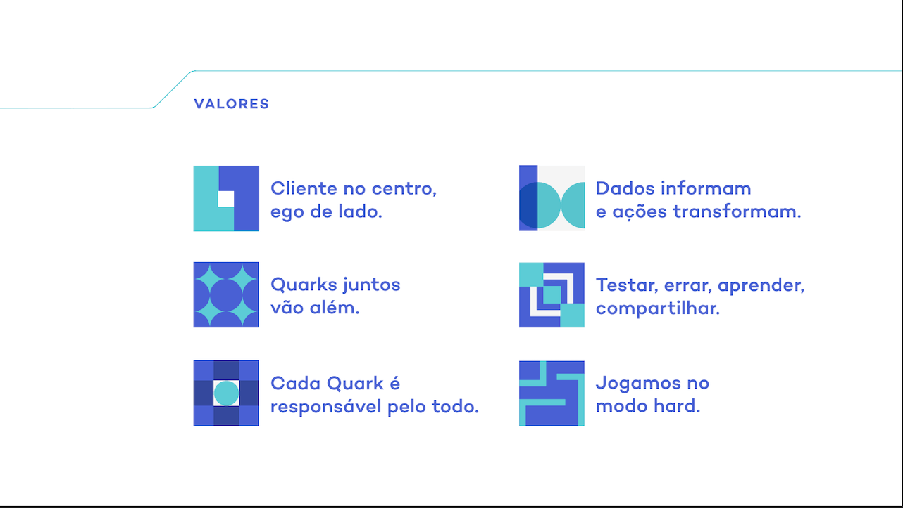

# Template Supertest e Jest-Cucumber

<div align="center">
  
</div>

## 📋 Introdução

Esse projeto é um template para testes utilizando o Jest e seus facilitadores. Aqui, temos exemplos de testes em uma API usando Supertest.
Para a documentação, utilizamos BDD e a biblioteca jest-cucumber para nos auxiliar na escrita.

## 💻 Pré-requisitos

Antes de começar, verifique se você atendeu aos seguintes requisitos:

* Você já instalou o node? Caso não tenha instalado, baixe .pkg **(Mac OS)** e siga as instruções no link abaixo:

  [Instalando o npm e node no Windows e no Mac](https://radixweb.com/blog/installing-npm-and-nodejs-on-windows-and-mac)

* Caso esteja usando uma distribuição **Linux Ubuntu**, segue: 

  [Instalando o node no Linux Ubuntu](https://www.geeksforgeeks.org/installation-of-node-js-on-linux/)


## 🚀 Instalando dependências

Para instalar as dependências desse projeto, siga a(s) instrução/instruções abaixo:

Linux e macOS:

Para esse contexto, iremos usar apenas os comandos de instalação das dependências:

```
npm i ou npm i -D
```

Caso você receba uma mensagem de <¡Erro!>, execute o comando dessa forma:

```
npm i -f ou npm install --force
```

Se um problema de vulnerabilidade qualquer for apresentado, utilize o seguinte comando:

```
npm audit fix -f
```

## ☕ Como utilizar o projeto

Para executar esse template, siga estas etapas:

```
npm run test <-- Para executar esse comando, no arquivo package.json, remova a instrução --detectOpenHandles ou execute:
npm run full
```

No **npm run test** serão executados todos os testes e o modo debug estará ativado *(vide jest.config.js)*. Os relatórios gerados ficarão dispostos na pasta **jest-reports**.

Ao executar o **npm run full**, o relatório **allure-jest** abrirá automaticamente no seu navegador padrão.

## 🏢 A estrutura

```
.
├── sources
|   ├── config
|   ├── jest-allure
|   ├── target
|   └── tests
|       ├── api
|       ├── data
|       ├── features
|       └── steps
```

ℹ️ Os relatórios são gerados uma pasta acima **(diretório raíz, antes da sources)** e estão dispostos na pasta jest-reports. São eles:

```
╒ jest-allure (main report)
╞ jest-coverage
╞ jest-html-reporters
╞ jest-simple-report (jest-report (default))
╘ jest-stare
```

## 📫 Contribuindo para o template supertest-jest-cucumber

Para contribuir com esse template, siga as seguintes etapas:

1. Bifurque este repositório (realize um fork conforme instruções da [github](https://docs.github.com/en/get-started/quickstart/fork-a-repo)).
2. Crie um branch: `git checkout -b <nome_branch>`.
3. Faça suas alterações e confirme-as: `git commit -m '<mensagem_commit>'`.
4. Envie para o branch original: `git push origin <nome_do_projeto> / <local>`.
5. Crie a solicitação de pull.

Como alternativa, consulte a documentação do GitHub em [como criar uma solicitação pull](https://help.github.com/en/github/collaborating-with-issues-and-pull-requests/creating-a-pull-request).

## 🤝 Contribuidores / Mantenedores

Agradecemos às seguintes pessoas que contribuíram para este projeto:

<table>
  <tr>
    <td valign="middle" align="center">
      <a href="https://www.linkedin.com/in/anderson-patricio-88280671/">
        
        <br>
        <sub>
          <b>Anderson Patricio</b>
        </sub>
      </a>
    </td>
    <td valign="middle" align="center">
      <a href="https://www.linkedin.com/in/lucasnunesr/">
        
        <br>
        <sub>
          <b>Lucas Nunes</b>
        </sub>
      </a>
    </td>
    <td valign="middle" align="center">
      <a href="https://www.linkedin.com/in/palleta/">
        
        <br>
        <sub>
          <b>Niky Lima</b>
        </sub>
      </a>
    </td>
    <td valign="middle" align="center">
      <a href="https://www.linkedin.com/in/roni-garcia-b52a972b/">
        
        <br>
        <sub>
          <b>Roni Garcia</b>
        </sub>
      </a>
    </td>
  </tr>
</table>

## 😎 Seja um dos contribuidores

Fique à vontade para contribuir nesse projeto! Clone, crie sua branch e seja feliz!

<div style="align-items: center; display: block; justify-content: center; padding: 10px; text-align: center;">
  <div style="float: left; margin: 0 auto; margin-bottom:15px; margin-top:15px; text-align: middle; width: 40%;">
  
  [](https://github.com/quan-to/)
  </div>
  <div style="float: left; margin: 0 auto; margin-bottom:15px; margin-top:15px; text-align: middle; width: 40%;">

  [](https://github.com/quan-to/)
  </div>
</div>
<br />

## Links úteis

[↳ Jest-Cucumber](https://github.com/bencompton/jest-cucumber)

[↳ Jest-Cucumber-Fusion](https://github.com/b-yond-infinite-network/jest-cucumber-fusion)

[↳ Projetos da comunidade fomentadora do Jest](https://github.com/jest-community)

[↳ Projeto utilizando Supertest](https://github.com/rsaccoll/sample-supertest)

[↳ Projeto utilizando Supertest + Jest](https://github.com/prasadmudedla/supertest-jest)

[↳ Todos os relatórios integrados com Jest](https://www.npmtrends.com/jest-allure-vs-jest-html-reporter-vs-jest-html-reporters-vs-jest-junit-reporter-vs-jest-silent-reporter-vs-jest-stare-vs-mochawesome-report-generator)

<br />

[⬆ Voltar ao topo](#Template-Supertest-e-Jest-Cucumber)

---
